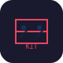

<!-- Improved compatibility of back to top link: See: https://github.com/othneildrew/Best-README-Template/pull/73 -->
<a id="readme-top"></a>

<!-- PROJECT SHIELDS -->
[![Contributors][contributors-shield]][contributors-url]
[![Forks][forks-shield]][forks-url]
[![Stargazers][stars-shield]][stars-url]
[![Issues][issues-shield]][issues-url]
[![MIT License][license-shield]][license-url]

<br />
<div align="center">
  <a href="https://github.com/RizkiRachman/opencode-kit">
    
  </a>

<h3 align="center">opencode-kit</h3>

  <p align="center">
    Standardized OpenCode orchestration framework — contract-based, rules-enforced, zero-touch agent workflow
    <br />
    <a href="https://github.com/RizkiRachman/opencode-kit"><strong>Explore the docs »</strong></a>
    <br />
    <br />
    <a href="https://github.com/RizkiRachman/opencode-kit/issues/new?labels=bug">Report Bug</a>
    &middot;
    <a href="https://github.com/RizkiRachman/opencode-kit/issues/new?labels=enhancement">Request Feature</a>
  </p>

  <p>
    <b>npm:</b> <code>@ikieaneh/opencode-kit</code> &middot;
    <b>macOS M-Series</b> — Apple Silicon (arm64)
  </p>
</div>

<!-- TABLE OF CONTENTS -->
<details>
  <summary>Table of Contents</summary>
  <ol>
    <li><a href="#about-the-project">About The Project</a></li>
    <li><a href="#philosophy">Philosophy</a></li>
    <li>
      <a href="#getting-started">Getting Started</a>
      <ul>
        <li><a href="#prerequisites">Prerequisites</a></li>
        <li><a href="#installation">Installation</a></li>
      </ul>
    </li>
    <li><a href="#usage">Usage</a></li>
    <li><a href="#structure">Structure</a></li>
    <li><a href="#the-6-pillars">The 6 Pillars</a></li>
    <li><a href="#contributing">Contributing</a></li>
    <li><a href="#license">License</a></li>
    <li><a href="#contact">Contact</a></li>
  </ol>
</details>

<!-- ABOUT THE PROJECT -->
## About The Project

`opencode-kit` is a **workflow enforcement framework** for AI coding agents. It ensures agents follow a structured process — plan, build, review, learn — instead of jumping straight to implementation.

### The Problem

AI agents (Claude, Copilot, etc.) are powerful but **unpredictable**. When given a task, they often:

- Skip project conventions and jump directly to writing code
- Ignore shared state — each session starts from scratch
- Bypass quality gates — no review, no scoring, no learning
- Use different approaches on every run — inconsistent results

Traditional frameworks try to fix this with **prose in .md files** ("load the contract before any tool call"). But agents routinely ignore prose because there's no enforcement — it's a suggestion, not a requirement.

### The Solution

`opencode-kit` replaces prose conventions with **machine-readable enforcement**:

| Instead of ... | opencode-kit uses ... |
|:---------------|:----------------------|
| "read the state file" | `contract.json` — a JSON state machine agents MUST read/write |
| "follow the rules" | `rules.json` — CRITICAL rules BLOCK agents, HIGH rules FLAG them |
| "check before editing" | `preflight.sh` — an enforcement gate that fails if rules aren't met |
| "review your work" | **Scoring pipeline** — every output is scored (≥70 PASS, <50 BLOCK) |
| "remember what you learned" | `postflight.sh` — auto-persists state + telemetry + lessons learned |

The result: **zero-touch agent workflow**. Set a goal, and the system self-executes through Plan → Build → Review → Learn, pausing only when BLOCKED.

### How It Works

As an OpenCode **plugin**, `opencode-kit` injects enforcement into every session globally via a **6-layer enforcement system**:

1. **Plugin bootstrap** — every session auto-loads the orchestration contract before any work
2. **Pre-flight gate** — validates branch, contract state, and rule compliance. BLOCKs on CRITICAL violations. Includes **state machine validation** (transition legality, required fields)
3. **Contract locking** — prevents concurrent contract modifications via file-based locks (`contract-lock.sh acquire/release`)
4. **Contract protocol** — shared state machine (`contract.json`) tracks phase, decisions, scores, telemetry
5. **Scoring pipeline** — every subagent output scored via `src/scoring-pipeline.sh`. ≥70 PASS, 50-69 RETRY, <50 BLOCKED
6. **Audit trail** — JSONL compliance logging (`audit-trail.sh`) records every enforcement action, score, and phase transition for later analysis
7. **ADR logging** — every architectural decision recorded in `decisions.adr_log[]`
8. **Extension model** — project-specific skills in `.opencode/skills/` override plugin defaults

### The 8 Built-in Skills

| Skill | Purpose |
|-------|---------|
| `orchestration-template` | Contract protocol, state machine, persistence rules |
| `scoring-pipeline` | Tier 1 rule checks + Tier 2 LLM judge + verdict |
| `adr-generator` | Architecture Decision Record format and auto-ID |
| `qa-expert` | Test standards, edge cases, coverage goals |
| `system-analyst` | Impact analysis, execution tracing, architecture checks |
| `token-optimize` | Efficient reading, batching, and delegation |
| `verification-before-completion` | Quality gates — formatting, compile, test, verify |
| `learner` | Post-execution learning, memory persistence |
| *(extensible)* | Create your own skills in `.opencode/skills/` |

### Built for Cost-Efficient Models

`opencode-kit` was designed for teams using **cost-optimized models** (DeepSeek V4 Flash, Gemini Flash, GPT-4o Mini, etc.) who want to compete with premium models through **process rigor**, not raw intelligence. The scoring pipeline and pre-flight enforcement create a quality floor that cheap models can meet through architecture, not model power.

### Platform Support

- **macOS M-Series** (Apple Silicon) — primary development target
- **Linux** (Ubuntu) — CI-verified via GitHub Actions
- **Any OpenCode-compatible environment** with `lean-ctx`, `gitnexus`, `graphify`

<p align="right">(<a href="#readme-top">back to top</a>)</p>

<!-- PHILOSOPHY -->
## Philosophy

### Data-driven enforcement, not convention

Most agent frameworks say "please load the envelope first" in prose. Agents ignore prose. `opencode-kit` stores rules as JSON and validates them with shell scripts — the agent can't work around a failing `preflight.sh`.

### Contract over envelope

The shared state is called a **contract**, not an envelope. A contract is legally binding — every agent agrees to its terms. Breaking the contract is a governance violation, not a suggestion.

### Score or fail

Every subagent output is scored on a 0-100 scale:
- **≥70** → PASS, advance to next phase
- **50-69** → RETRY (up to 3 attempts)
- **<50** → BLOCKED (escalate to user)

This creates a quality floor that cheap models can meet through architecture, not raw intelligence.

<p align="right">(<a href="#readme-top">back to top</a>)</p>

<!-- GETTING STARTED -->
## Getting Started

### Prerequisites

- **macOS** on Apple Silicon (M1, M2, M3, or M4)
- **Node.js** ≥ 18 (for `npx` support)
- **Git** (for version control)
- **OpenCode** with the following MCPs configured:
  - `lean-ctx` (context persistence)
  - `gitnexus` (code intelligence)
  - `graphify` (knowledge graph)

```sh
# Verify prerequisites
node --version    # ≥ 18
git --version     # any recent version
```

### Documentation Guides

| Guide | Description |
|-------|-------------|
| [Contract Protocol](docs/guides/contract-protocol.md) | State machine, fields, resolution order |
| [Scoring Pipeline](docs/guides/scoring-pipeline.md) | Tier 1 + Tier 2 + verdict |
| [Troubleshooting](docs/guides/troubleshooting.md) | Common issues and solutions |
| [Quickstart](docs/examples/QUICKSTART.md) | 6-step setup from scratch |
| [Extension Skills](docs/examples/extension-skill-template.md) | Create project-specific skills |
| [Model Configs](docs/examples/model-configs.md) | Provider configuration examples |
| [Enforcement Architecture](docs/guides/enforcement-architecture.md) | 6-layer enforcement system |

### Installation

#### Option 1: Install as plugin (recommended)

Add to your project's `opencode.json`:

```json
{
  "plugin": [
    "@ikieaneh/opencode-kit",      ← MUST be first
    "other-plugins..."
  ]
}
```

Then install:

```sh
npm install @ikieaneh/opencode-kit
```

The plugin auto-loads on next session. All 8 skills become available. The orchestration contract is injected into every session automatically.

> **Plugin ordering**: opencode-kit MUST be first in the plugin array. Its system prompt transform is foundational — other plugins may add behavior, but opencode-kit enforces the workflow.

#### Option 2: Quick scaffold (pre-v0.4 style)

```sh
npx opencode-kit init
```

This scaffolds the full framework into your current project directory. Compatible with plugin mode — use both for maximum control.

#### Option 3: From source

```sh
git clone https://github.com/RizkiRachman/opencode-kit.git
cd your-project
/path/to/opencode-kit/src/init.sh
```

#### Option 4: TUI commands (optional)

For `/`-slash commands and Ctrl+P command palette integration, add the TUI plugin:

```json
{
  "plugin": [
    "@ikieaneh/opencode-kit",
    "@ikieaneh/opencode-kit/tui",   ← Adds Ctrl+P commands
    "other-plugins..."
  ]
}
```

The TUI plugin registers 5 commands that appear in the command palette and as `/`-slash commands:

| Slash | Alias | Action |
|-------|-------|--------|
| `/kit-init` | `/ki` | Scaffold orchestration framework |
| `/kit-doctor` | `/kd` | Run diagnostics |
| `/kit-status` | `/ks` | Show contract state |
| `/kit-verify` | `/kv` | Verify installation |
| `/kit-adr` | `/ka` | Record an Architecture Decision Record |

Type `/kit-` in the chat input or `Ctrl+P` to see all available opencode-kit commands.

> **Plugin ordering**: The TUI plugin (`@ikieaneh/opencode-kit/tui`) should come **after** the server plugin. The server plugin must still be first in the array.


### Post-install verification

```sh
.opencode/src/verify.sh
```

Expected output:
```
✅ contract.json
✅ rules.json
✅ agents/orchestrator.md (has pre-flight gate)
✅ agents/planner.md (has pre-flight gate)
...
✅ All checks passed
```

<p align="right">(<a href="#readme-top">back to top</a>)</p>

<!-- USAGE -->
## Usage

### 1. Set a goal

Edit `.opencode/orchestration/contract.json`:

```json
{
  "state": "INIT",
  "requirements": {
    "goal": "Add user authentication with JWT",
    "acceptance_criteria": [
      "Users can register with email + password",
      "Users can login and receive a JWT token",
      "Tokens expire after 24 hours"
    ],
    "constraints": ["No new dependencies", "Follow hexagonal architecture"]
  }
}
```

### 2. Start working

Every agent session automatically:

1. **Loads the contract** (BLOCKED if missing)
2. **Validates branch** (BLOCKED if on main)
3. **Validates state** (BLOCKED if wrong phase)
4. **Checks rules** (CRITICAL violations = BLOCK)

### 3. The workflow runs itself

```
INIT → PLAN → PLAN_SCORED → EXECUTE → EXECUTE_SCORED → REVIEW → REVIEW_SCORED → COMPLETE
                                        ↓
                                     BLOCKED ← user intervention → retry
```

Each phase transition requires a score ≥70 to proceed.

### CLI Commands

Once installed, run these from the project root:

| Command | Purpose |
|---------|---------|
| `bash .opencode/src/status.sh` | Dashboard — contract state, telemetry, rules |
| `bash .opencode/src/doctor.sh` | Diagnostics — MCPs, contract, git, persistence |
| `bash .opencode/src/analytics.sh` | Telemetry aggregation — phase times, cost estimates |
| `bash .opencode/src/diff.sh` [branch1] [branch2] | Compare contract state between branches |
| `bash .opencode/src/adr.sh` | Record a new Architecture Decision Record |
| `bash .opencode/src/telemetry.sh` | View telemetry details |
| `bash .opencode/src/new-skill.sh` <name> | Scaffold a new skill SKILL.md |
| `bash .opencode/rules/validation.sh` | Validate rules compliance |
| `bash .opencode/src/adoption-check.sh` | Verify project is initialized |
| `bash .opencode/src/contract-lock.sh acquire/release` | Contract file locking |
| `bash .opencode/src/audit-trail.sh` | Audit trail management |
| `bash .opencode/src/scoring-pipeline.sh` | Run scoring pipeline |
| `bash .opencode/src/contract-lint.sh` | Validate contract structure |
| `npx opencode-kit --version` | Print version |
| `npx opencode-kit --help` | Print help |

## Slash Commands (TUI)

Use these directly in the opencode TUI with the `opencode-kit:` prefix:

| Command | Description |
|---------|-------------|
| `/opencode-kit:doctor` | Run project health checks |
| `/opencode-kit:status` | Show project status |
| `/opencode-kit:analytics` | Show project analytics |
| `/opencode-kit:preflight` | Run pre-flight gate checks |
| `/opencode-kit:score` | Run scoring pipeline |
| `/opencode-kit:contract-lint` | Validate contract structure |
| `/opencode-kit:checkpoint` | List saved checkpoints |
| `/opencode-kit:checkpoint-save` | Save a checkpoint |
| `/opencode-kit:diff` | Show contract changes |
| `/opencode-kit:audit` | Query audit trail |
| `/opencode-kit:verify` | Verify project setup |
| `/opencode-kit:lock` | Check contract lock status |
| `/opencode-kit:init` | Initialize opencode-kit |
| `/opencode-kit:update` | Update templates |
| `/opencode-kit:adr` | Create Architecture Decision Record |

All commands use `lean-ctx ctx_shell` internally (no bash permission required for agents).


<p align="right">(<a href="#readme-top">back to top</a>)</p>

<!-- STRUCTURE -->
## Structure

```
opencode-kit/
 ├── rules/
 │   ├── rules.json              ← Machine-enforceable rules (CRITICAL/HIGH/state machine)
 │   └── validation.sh           ← Validates agent actions against rules
 ├── src/
 │   ├── init.sh                 ← Scaffold into target project
 │   ├── preflight.sh            ← Envelope load gate (zero deps, fails if rules violated)
 │   ├── postflight.sh           ← Auto-persist + scoring pipeline + contract migration
 │   ├── doctor.sh               ← Diagnostic command
 │   ├── status.sh               ← Dashboard view
 │   ├── diff.sh                 ← Compare contract across branches
 │   ├── analytics.sh            ← Telemetry aggregation
 │   ├── adr.sh                  ← ADR auto-generator
 │   ├── telemetry.sh            ← Phase telemetry viewer
 │   ├── new-skill.sh            ← Skill template generator
 │   ├── update.sh               ← Pull latest from GitHub
 │   ├── verify.sh               ← Installation health check
 │   ├── platform.sh             ← Cross-platform detection
 │   ├── global-config.sh        ← Config resolution chain
  │   ├── scoring-pipeline.sh    ← Tier 1 rule-based scoring engine
  │   ├── contract-lock.sh       ← File locking for concurrent access
  │   ├── adoption-check.sh      ← Verify project is initialized
  │   ├── audit-trail.sh         ← JSONL compliance audit log
  │   └── cli.js                  ← --version / --help
  ├── skills/                     ← 9 auto-registered skills
  ├── templates/
  │   ├── contract.json           ← Shared state contract
  │   ├── contract.schema.json    ← JSON Schema for contract
  │   ├── opencode-kit.schema.json ← Agent config schema
  │   ├── judge-prompt.md         ← LLM judge prompt template
  │   ├── escalation.md           ← BLOCKED recovery protocol
  │   ├── handoff.md              ← Agent handoff protocol
  │   ├── rollback.md             ← Rollback strategy
  │   └── agents/                 ← 10 agent .md templates
 ├── docs/
 │   ├── guides/                  ← Usage guides (contract, scoring, troubleshooting)
 │   ├── examples/                ← Quickstart, model configs, extension skills
 │   └── plans/                   ← Implementation plans
 ├── test/                       ← Integration + E2E tests (16 total)
 ├── .github/workflows/          ← CI (ShellCheck + scaffold + tests)
 ├── .opencode/plugins/          ← Plugin entry points
 │   ├── opencode-kit.js        ← Server plugin (hooks, transform)
 │   └── opencode-kit-tui.js     ← TUI plugin (commands, palette)
 ├── .claude-plugin/             ← Plugin metadata
 ├── package.json                ← npm publish
  ├── CHANGELOG.md
  ├── CONTRIBUTING.md
  └── RELEASE.md
```

<p align="right">(<a href="#readme-top">back to top</a>)</p>

<!-- THE 6 PILLARS -->
## The 6 Pillars

### 1. GitNexus — Code Intelligence

**Rule**: `IMPACT_001` — CRITICAL. Agent MUST run `gitnexus_impact` before editing any symbol.

```sh
# Before touching any code:
gitnexus_impact({target: "symbolName", direction: "upstream"})
# If HIGH/CRITICAL risk → BLOCK, report to user
```

### 2. Graphify — Knowledge Graph

**Rule**: Agents MUST explore unfamiliar code via graph queries, not linear file reads.

```sh
graphify query "<question>"     # Scoped subgraph exploration
```

### 3. Lean Ctx — Context Persistence

**Rule**: `PERSIST_001` — HIGH. Contract MUST be persisted after every delegation/phase change.

```sh
lean-ctx ctx_knowledge remember key orchestration-contract value <updated JSON>
```

### 4. Workflow State — State Machine

**Rule**: `STATE_001` — CRITICAL. Agents can only act in correct state.

```json
{
  "transitions": [
    { "from": "INIT", "to": "PLAN" },
    { "from": "PLAN", "to": "PLAN_SCORED" },
    { "from": "PLAN_SCORED", "to": "EXECUTE", "require_score": 70 },
    ...
    { "from": "*", "to": "BLOCKED", "condition": "score < 50 OR attempts >= 3" }
  ]
}
```

### 5. ADR — Architecture Decision Records

Every decision is logged in `contract.json.decisions.adr_log[]` with structured format:

```json
{
  "decisions": {
    "adr_log": [
      { "id": "ADR-001", "date": "2026-06-11", "title": "Orchestration framework",
        "context": "Agents bypassed envelope protocol", "decision": "Switch to contract + rules.json",
        "alternatives": ["Keep envelope", "Use script enforcement"],
        "consequences": "Stronger enforcement, more scaffolding on init" }
    ]
  }
}
```

### 6. Scoring — Quality Pipeline

After every subagent delegation, scoring runs automatically:
1. **Tier 1** — Rule-based checks (schema valid, permissions OK, blast radius safe)
2. **Tier 2** — LLM judge (fulfills requirements? follows governance? complete?)
3. **Tier 3** — Combined verdict (PASS/RETRY/BLOCKED)

<p align="right">(<a href="#readme-top">back to top</a>)</p>

<p align="right">(<a href="#readme-top">back to top</a>)</p>

<!-- CONTRIBUTING -->
## Contributing

See [CONTRIBUTING.md](CONTRIBUTING.md) for full guidelines.

TL;DR: Fork → Feature branch → Commit → PR. Follow the 6-pillar architecture. All rules enforcements must be tested.

<p align="right">(<a href="#readme-top">back to top</a>)</p>

<!-- LICENSE -->
## License

Distributed under the MIT License. See `LICENSE` for more information.

<p align="right">(<a href="#readme-top">back to top</a>)</p>

<!-- CONTACT -->
## Contact

## Known Limitations

- **Plugin hook API**: The `experimental.chat.messages.transform` hook is marked as experimental in the OpenCode plugin SDK. It may change in future versions. If it breaks, the plugin falls back to per-project agent .md files (`.opencode/agents/*.md`), which remain functional.
- **Package name**: Currently published as `@ikieaneh/opencode-kit` (scoped). Requires `npm install @ikieaneh/opencode-kit`.
- **TUI plugin**: `@ikieaneh/opencode-kit/tui` requires OpenCode with TUI support (version with `TuiPluginApi`). It registers commands in the Ctrl+P palette and as `/`-slash commands. Scripts are run synchronously via Node.js `execSync` — long-running scripts may block the UI temporarily.
- **Contract auto-init**: Requires a git repository. Non-git projects use absolute path as hash fallback.

Rizki Rachman — [GitHub](https://github.com/RizkiRachman)

Project Link: [https://github.com/RizkiRachman/opencode-kit](https://github.com/RizkiRachman/opencode-kit)

<p align="right">(<a href="#readme-top">back to top</a>)</p>

<!-- MARKDOWN LINKS & IMAGES -->
[contributors-shield]: https://img.shields.io/github/contributors/RizkiRachman/opencode-kit.svg?style=for-the-badge
[contributors-url]: https://github.com/RizkiRachman/opencode-kit/graphs/contributors
[forks-shield]: https://img.shields.io/github/forks/RizkiRachman/opencode-kit.svg?style=for-the-badge
[forks-url]: https://github.com/RizkiRachman/opencode-kit/network/members
[stars-shield]: https://img.shields.io/github/stars/RizkiRachman/opencode-kit.svg?style=for-the-badge
[stars-url]: https://github.com/RizkiRachman/opencode-kit/stargazers
[issues-shield]: https://img.shields.io/github/issues/RizkiRachman/opencode-kit.svg?style=for-the-badge
[issues-url]: https://github.com/RizkiRachman/opencode-kit/issues
[license-shield]: https://img.shields.io/github/license/RizkiRachman/opencode-kit.svg?style=for-the-badge
[license-url]: https://github.com/RizkiRachman/opencode-kit/blob/main/LICENSE
